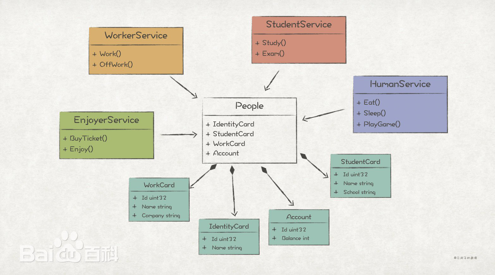

# godot-dci
Lightweight dci framework wirtten with gdscript.



# Features

- Lightweight and non-intrusive.
- Easy to use.

# How To Use

- Copy the 'dci' directory to any location within your Godot project.
- Begin your DCI coding journey with the following code:

```

# define data
class Person extends dci_data:
	var name: String = "Player"
```

```

# define role (Interactions)
class swimmer extends dci_behavior:
	func swim() -> dci_behavior:
		print("%s Swim." % data().name)
		return self
	
class superman extends dci_behavior:
	func fly() -> dci_behavior:
		print("%s Fly." % data().name)
		return self
```

```

# define context
class FlyContext extends dci_context:
	# override
	func _on_execute(data):
		assert(sender() is superman, "type not match!")
		sender().fly()
```

```

# create dci environment
var dci = dci_env.new()

# register role
dci.add_behavior("swimmer", swimmer)
dci.add_behavior("superman", superman)

# register context
dci.add_context("FlyContext", FlyContext.new())
dci.add_callable("FlyLambda", func(ctx: dci_context, data):
	assert(ctx.sender() is superman, "type not match!")
	ctx.sender().fly()
)

# data usage
var man: Person = Person.new().with(dci)

# cast role
man.cast("swimmer").swim() \
	.cast("superman").fly()

# cast and context execute
man.cast("superman").execute("FlyContext")
man.cast("superman").execute("FlyLambda")

```
